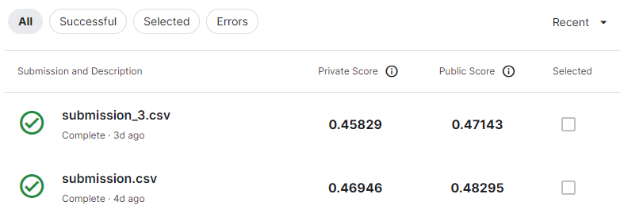

# DM2023-Lab2-Homework (Homework 2 for ISA5810)

> kaggle (競賽內容)
> 
>> LLM_model ------- 存放LLM model
>> 
>> kaggle_1.ipynb --- 採用BOW分詞、向量化，並使用MLP model
>> 
>> kaggle_2.ipynb --- 採用LLM
>> 
>> kaggle_3.ipynb --- 採用TF-IDF分詞、向量化，並使用MLP model
>> 
> DM2023-Lab2-Homework.ipynb (作業內容)

* 詳細的說明皆有寫在'kaggle_1.ipynb'、'kaggle_2.ipynb'、'kaggle_3.ipynb'、'DM2023-Lab2-Homework.ipynb'檔案內!!!

* 最終的排名分數是'kaggle_1.ipynb'所跑出來的結果

從上圖來看，submission.csv的分數是採用BOW方法，而submission_3.csv是採用TF-IDF的方法，從結果來看可以發現BOW方法的表現比較好。我認為可能在這筆文本中，所謂的IDF可能是相對重要的詞彙。意思是說在TF-ID中，當一個詞彙出現在越多文本中，代表該詞彙並不是那麼的重要，或許是在這筆文本中並不適用這種假設前提。當然也有可能是因為我並沒有做任何的前處理所導致，可能文本中就含有過多的雜訊或是無意義的stop word，使得TF-IDF和BOW的效果都不是很理想。
